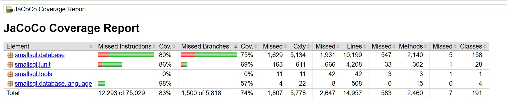

# Test Coverage Automation with JaCoCo

This directory contains two batch files that, when run properly, will create and open the test coverage results for a given project using JaCoCo.

## Overview

The two batch files are:

1. **`run_commands.bat`**: Sets the Java version to Java 5, then runs JaCoCo to execute the existing tests and generate jacoco.exec
2. **`generate_result.bat`**: Generates the test coverage report (.html file) from jacoco.exec and then opens it

## Usage

### 1. `run_commands.bat`

This batch file requires 3 variables as input:
1. **Path to the `bin` directory of the project** (e.g., `".\resources\smallsql0.21_src\bin"`).
2. **Path to the JUnit JAR file** (e.g., `".\resources\smallsql0.21_src\lib\junit-3.8.1.jar"`).
3. **Name of the main test class file with its package name** (e.g., `smallsql.junit.AllTests`).

### 2. `generate_result.bat`
This batch file requires 2 variables as input:
1. **Path to the `bin` directory of the project** (e.g., `".\resources\smallsql0.21_src\bin"`).
2. **Path to the `src` directory of the project** (e.g., `".\resources\smallsql0.21_src\src"`).

## Example - smallSql
The resources directory already contains the smallsql0.21_src project. To run the batch files on the SmallSQL project, execute the following commands from main folder:
1. `run_commands.bat ".\resources\smallsql0.21_src\bin" ".\resources\smallsql0.21_src\lib\junit-3.8.1.jar" smallsql.junit.AllTests`
2. `generate_result.bat ".\resources\smallsql0.21_src\bin" ".\resources\smallsql0.21_src\src"`

The results for smallsql:

**Mark**: +
